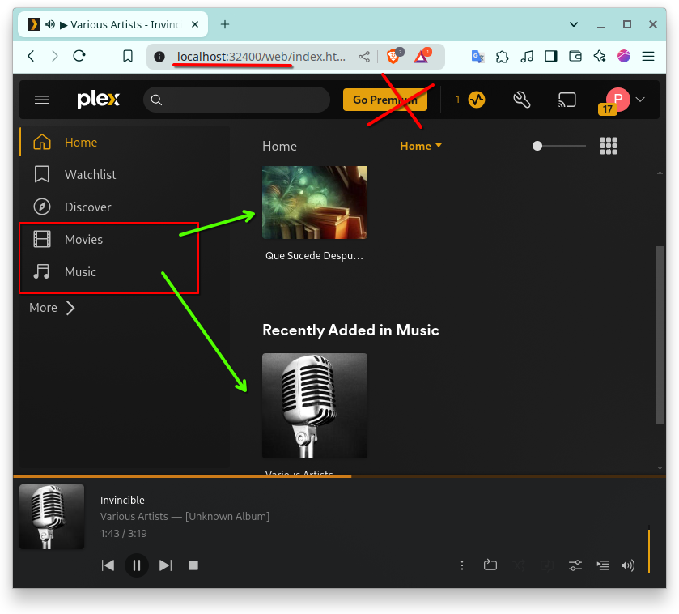

# plex server

simple servidor de musica video 

NO me gusto debido a mucha publicidad y muy sobrecargado

solo quiero escuchar musica y ver video simples

`docker-compose.yml` is a simple docker config

    environment:
        - TZ=America/Lima
        - PLEX_GID=1000
        - PLEX_UID=1001

Importante crear los directorios:

    mkdir -p ./plex/config ./plex/transcode ./plex/media

Note: puedes agregar los directorios para que almacenes videos y musica en

    ./plex/media/video
    ./plex/media/music

En PLEX connfiguration deberas agregar en (LIBRARY) estos directorios con archivos para que  
puedas escuchar y ver el archivo

### Start project

commands

    docker-compose -up

Puedes abrir la URL: http://localhost:32400/web

